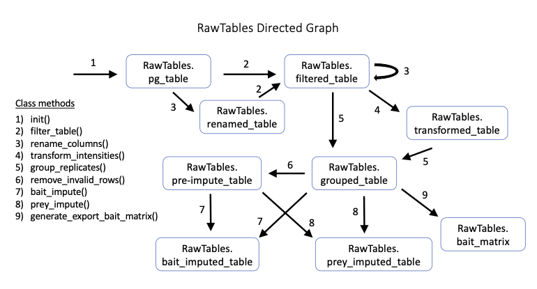
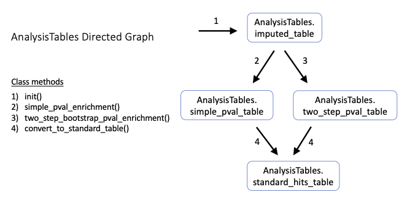
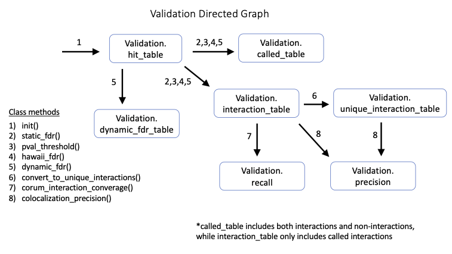

# Pyseus: Perseus in Python

## Table of Contents

- [Pyseus: Perseus in Python](#pyseus-perseus-in-python)
  - [Table of Contents](#table-of-contents)
  - [Introduction](#introduction)
  - [RawTables Class](#rawtables-class)
    - [<ins>Initiation Parameters](#insinitiation-parameters)
    - [<ins>Class Methods](#insclass-methods)
  - [AnalysisTables Class](#analysistables-class)
    - [<ins>Initiation Parameters](#insinitiation-parameters-1)
    - [<ins>Exclusion Matrix class methods](#insexclusion-matrix-class-methods)
    - [<ins>Enrichment / Significance testing class methods](#insenrichment--significance-testing-class-methods)
  - [Validation Class](#validation-class)
    - [<ins>Class methods](#insclass-methods-1)
  - [Included Notebooks](#included-notebooks)
      - [<ins>change_sample_names.ipynb](#inschange_sample_namesipynb)
      - [<ins>process_raw_file.ipynb](#insprocess_raw_fileipynb)
      - [<ins>plot_intensity_matrix.ipynb](#insplot_intensity_matrixipynb)
      - [<ins>volcano_plot.ipynb](#insvolcano_plotipynb)


## Introduction

This repository contains source code and notebooks to process and analyze Mass-Spec output from the MaxQuant software, mainly utilizing the ```proteingroups.txt``` output file. However, features are in place to accept most feature tables that follow a standard format.

The feature matrix is converted into Pandas DataFrames stored as objects in appropriate python classes, which contain transformation and analysis methods. There are currently 3 main classes that deal with raw table processing, interaction calling, and validation of the analysis, respectively.

## RawTables Class
RawTables class can be found on the ```basic_processing.py``` module of Pyseus. It takes the initial ```proteingroups.txt``` file and processes it into an organized, filtered DataFrame ready for significance/enrichment calculations. The following are the init parameters of the class and its main class methods.




### <ins>Initiation Parameters
* experiment_dir: str of directory address where the proteingroup file resides
* analysis: str of analysis name, useful for versioning different analyses from the same proteingroup file
* pg_file: str of filename of the proteingroup file. Default = 'proteinGroups.txt'
* info_cols: list of str, manual designation of columns to be used for metadata or information. If None, a preset of columns in the __init__ function is selected. Default = None.
* sample_cols: list of str, manual designation of sample columns. If None, all sample intensity columns are selected. Default = None
* intensity_type: str designating which intensity type to use- "Intensity" or "LFQ intensity". Default = "Intensity"
* proteingroup: pandas df, manual designation of proteingroups file already loaded as a dataframe. Default = None
* file_designated: bool of whether a proteingroup is designated manually. Default: False

### <ins>Class Methods
* ```filter_table()``` : filter rows that do not meet the QC (contaminants, reverse seq, only identified by site), and also filter non-intensity columns that will not be used for further processing
* ```transform_intensities()```: transform intensities values by any given function, default is log2 transformation
* ```group_replicates()```: Using regular expression, group replicates of the same biological sample together through multi-level columns in a dataframe. Also separate sample columns with metadata columns.
* ```remove_invalid_rows()```: Remove rows (protein groups) that do not have at least one group that has values in all triplicates
* ```bait_impute()```: bait-imputation for sets of data without enough samples- imputes a value from a normal distribution of the left-tail of a bait’s capture distribution for the undetected preys using multi-processing.
* ```prey_impute()```: For protein groups with less than threshold number of sample number, impute a value from a normal distribution of the prey’s capture distribution using multi-processing. Note- most protein groups do not need imputation with 12-plate MBR
* ```generate_export_bait_matrix()```: Generates and saves a Boolean bait matrix that is used as a control exclusion matrix in AnalysisTables class.
* ```rename_columns()```: change intensity column names based on regular expressions
* ```save()```: save the entire class object in the analysis directory as a pickle

<br>
<br>

## AnalysisTables Class
AnalysisTables class can be found on ```primary_analysis.py```, and uses the imputed table and exclusion matrix output from RawTables class to perform essential analysis including enrichment/significance testing to call interactions and stoichiometry calculations.

### <ins>Initiation Parameters
* root: str of the directory of the experiment where the proteingroups file exists
* analysis: str of the analysis name (previously designated on RawTables class)
* imputed_table: pandas DF of the imputed table generated by either ```bait_impute()``` or ```prey_impute()``` methods in the ```RawTables``` class
* exclusion_matrix: pandas df of the bait matrix generated by the ```generate_export_bait_matrix()``` method in the ```RawTables``` class


### <ins>Exclusion Matrix class methods

AnalysisTables class can utilize the exclusion matrix, which is a user-defined set of sample & negative control to be used for enrichment/significance testing. The following are helpful methods in manuplating the matrix:
* ```restore_default_exclusion_matrix()```: restore the exclusion matrix to default - no exclusion of any baits / negative controls
* ```load_exclusion_matrix()```: load user-defined exclusion matrix
* ```print_baits()```: print all baits in the analysis
* ```print_controls()```: print all the selected controls for an input bait
* ```print_excluded_controls()```: print all the excluded controls for an input bait
* ```select_wildtype_controls()```: Using string operation, select only matching samples to use as controls and exclude all others. Default search string: '_WT'

<br>



### <ins>Enrichment / Significance testing class methods
* ```simple_pval_enrichment()```: calculate enrichment and pvals for each bait using user-defined exclusion matrix
* ```two_step_bootstrap_pval_enrichment()```: The two-step bootstrap pval/enrichment calculations does not use an exclusion table of user defined controls. It automatically drops statistically significant outliers from the prey pool on the first round, and uses the distribution with dropped outliers to calculate bootstrapped null distribution. The null distribution of the preys are then used in the second round for pval and enrichment calculation.
* ```convert_to_standard_table()```: the standard table no longer uses column organization for baits. It follows a more SQL-like form where bait information is provided in separate columns

<br>
<br>

## Validation Class
Validation class can be found in the ```validation_analysis.py``` module and uses the ```standard_hits_table``` from ```AnalysisTables``` class for various post-processing or validation methods.




### <ins>Class methods
* ```static_fdr()```: Call significant interactors from standard hits table with user input offset and curvature for thresholding
* ```dynamic_fd()```: compute dynamic FDR for each plate-bait group in the standard table
* ```convert_to_unique_interactions()```: The nature of MS-IP presents possibilities for duplicate interactions, this function removes such duplicates. As a consequence, the direction of interactions is lost (no more bait/prey designations), but maximum edge values can be optionally conserved.
* ```corum_interaction_coverage()```: Calculates the recall of the interactome, using CORUM interactions as a ground truth. The function is utilized in generating a precision-recall curve of the interactome.
* ```colocalization_precision()```: Calculates the precision of the interactome, using broad localization patterns as a ground truth. THis function is utilized in generating a precision--recall curve of the interactome.


## Included Notebooks
Notebooks are useful for streamlined analysis, often taking wrapper functions that encompass many methods together. For proper usage, the user must save directories that include the proteingroups.txt file in the data folder.

#### <ins>change_sample_names.ipynb
This notebook allows easy manipulation of column names before raw processing. Pyseus works with intensity columns that are organized in <b>experiment_sample_replicate# </b>. For example <b>Glycine-Low-pH_LAMP1_2</b> would be organized as '<b>Glycine-Low-pH</b>' (<i>experiment</i>), '<b>LAMP1</b>' (<i>sample</i>), and '<b>2</b>' (<i>replicate #</i>). Dashes can be used as added descriptors for each section, but underscores need to be reserved for the separation. ex: 'Glycine_Low_pH_LAMP1_2 will not work as a sample title.
#### <ins>process_raw_file.ipynb
This notebook allows users to process proteingroups file and calculate p-values and enrichments.
#### <ins>plot_intensity_matrix.ipynb
Users can view interactive graphs of the intensity matrix from imputed tables
#### <ins>volcano_plot.ipynb
Users can select a specific sample (bait) to draw an interactive volcano plot
