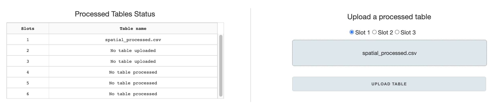

# Pyseus Explorer

## Table of Contents
- [Pyseus Explorer](#pyseus-explorer)
  - [Table of Contents](#table-of-contents)
  - [Introduction](#introduction)
  - [Home page](#home-page)
  - [Pre-processing](#pre-processing)
    - [<u> Raw table upload & feature designation </u>](#u-raw-table-upload--feature-designation-u)
    - [<u> Renaming samples </u>](#u-renaming-samples-u)
    - [<u> Processing options </u>](#u-processing-options-u)
    - [<u> Saving/caching processed table </u>](#u-savingcaching-processed-table-u)
  - [Clustergram](#clustergram)
    - [<u> Loading table and color scale options </u>](#u-loading-table-and-color-scale-options-u)
    - [<u> Plotting tab </u>](#u-plotting-tab-u)
  - [Enrichment calculation / Volcano plot](#enrichment-calculation--volcano-plot)
    - [<u> Calculate enrichment & significance </u>](#u-calculate-enrichment--significance-u)
      - [<u> Control selection </u>](#u-control-selection-u)
      - [<u> Enrichment calculation and saving table </u>](#u-enrichment-calculation-and-saving-table-u)
    - [<u> Loading data for hit-calling and volcano plot </u>](#u-loading-data-for-hit-calling-and-volcano-plot-u)
    - [<u> Hit-calling </u>](#u-hit-calling-u)
    - [<u> Volcano plot </u>](#u-volcano-plot-u)
      - [<u> Plotting options </u>](#u-plotting-options-u)
      - [<u> Data selection within figure </u>](#u-data-selection-within-figure-u)
    - [<u>External annotations </u>](#uexternal-annotations-u)
    - [<u> Annotation enrichment analysis </u>](#u-annotation-enrichment-analysis-u)
    - [<u> Selection GO analysis </u>](#u-selection-go-analysis-u)
  - [UMAP](#umap)
    - [<u> Feature selection & UMAP calculation </u>](#u-feature-selection--umap-calculation-u)
      - [<u> Upload table & feature selection </u>](#u-upload-table--feature-selection-u)
      - [<u> UMAP options </u>](#u-umap-options-u)
    - [<u> Plotting UMAP </u>](#u-plotting-umap-u)
      - [<u> Upload UMAP table / Link annotations </u>](#u-upload-umap-table--link-annotations-u)
      - [<u> Figure options </u>](#u-figure-options-u)
      - [<u> Data selection within UMAP figure </u>](#u-data-selection-within-umap-figure-u)
      - [<u> Selection GO analysis </u>](#u-selection-go-analysis-u-1)

## Introduction
Pyseus Explorer is a mass-spec analysis and exploration web app built with Dash framework, using the Pyseus source code for backend calculations. It provides an easy, interactive UI to guide users through processing mass-spec data and generating figures and analyses.

## Home page
The home page has a basic interface to upload previously processed tables to designated slots, and to check the status of the slots.

```Processed tables``` are standard-format tables that are generated by the ```pre-processing``` page. Each visualization page uses the processed table as a starting basis for figure generation.


```Slots``` can be used to store processed tables for the duration that the web-application is open, allowing the user to navigate through different visualization pages and load slotted processed tables as desired. Slots 1-3 are designated for upload through the ```Home``` page, while slots 4-6 are designated for saves in the ```pre-processing``` page.

<br>

## Pre-processing
The pre-processing page allows for data filtering, transformation, and conversion to standard format from raw feature tables.
### <u> Raw table upload & feature designation </u>
```Raw tables``` must be a format in which samples/features must be in columns and observations in rows. Currently Pyseus supports CSVs and TSVs, which can be specified by buttons on the upload section. Columns also must be specified in a single row - however, top rows with nonessential column information can be skipped.
<br>


Once a table has been uploaded and read by the application, lists of column names will be populated in the ```Select sample and metadata columns``` section. You need to select which columns will be used as samples/features, or serve as metadata (e.g. labels, annotations). You can use regular expression search to make sample selection faster. After making the selection, press the ```Save sample/metadata columns``` button.

<br>

### <u> Renaming samples </u>
Renaming samples to standard format is essential. The sample naming format is as follows:
<br>
```experiment_sample_rep#```
<br>
Examples: ```CZBSU_LAMP1_1``` or ```20211031_infected-24hr_2``` or ```LAMP1_1```
<br>
The underscores must be preserved for the separation of the categories. Use dashes for decorators.


<br>

There are two regular expression (RE) entries for renaming samples: ```search REs``` and ```replacement REs```. The entries are used to work similarly as a find/replace function. There can be multiple search/replace RE entries, split by ```semi-colons```. The regular expression replacement is sequential - first entry will be replaced with first replacement, followed by the next ones after semi-colon, etc.
<br>
When filling out the entries, make sure that the number of semi-colons in each entry is matching, and the regular expressions are space sensitive.

<br>

### <u> Processing options </u>


Select all options that you want for the processing of the raw table. Here are some caveats:

* ```Filter rows``` only works for MaxQuant outputs
* ```Rename samples``` MUST have appropriate regular expressions from previous tab
* ```Remove incomplete rows``` and ```merge technical replicates``` require presence of technical replicates, designated by sample naming of sample_rep# e.g. ATL3_2.
* If you ```merge technical replicates```, you will NOT be able to calculate enrichment/significance for volcano plots.
* Currently, UMAP figure generator requires you to ```replace null values```, else the entire rows with null values will be dropped.

After you have filled all the processing options, click the ```Process MS Table``` button for pre-processing. Once the button changes color, the processing is complete.

<br>

### <u> Saving/caching processed table </u>
You can save the processed file for future use with the ```Download Processed MS Table``` button. You can also save and download all the options you have selected with the ```Download Configs File``` button. You can upload the configs file in the future by pre-loading configs (Found on top right of the first tab).
<br>

If you plan to continue using the processed table in this session, you can cache it to one of the 3 available slots, using the ```Save processed table to an internal slot``` section. Cached tables only last for the duration of the webapp session, and will be wiped after you refresh the page or quit the tab. So please download the processed table if you plan to use it again in the future.

<br>

## Clustergram
### <u> Loading table and color scale options </u>
To begin, upload a ```processed table``` from previous sessions, or load a cached table.
<br>


<!--  -->
```{eval-rst}
.. image:: ./images/clustergram_1.png
    :width: 300px
```

For the clustergram generator to function properly, you must select an index of unique identifiers (usually Protein IDs if using MaxQuant outputs), and a label to represent each data.
Then, select all samples you would like represented on the clustergram.
<br>


You can standardize/normalize data using ```feature scaling``` options if you wish.
Before you generate the clustergram, you need to tune the color scale for the clustergram. To assist you with this, the ```summary statistics``` table gives you essential numbers such as min, max, mean, and stdev of the data.
With the info, you can set the min/max value of the color scale, and choose a color map you prefer. Clicking the ```Apply Options``` button will give you a preview of the color scales with the parameters you have input.

<br>

### <u> Plotting tab </u>
There are a few options you can specify on the plotting tab on the left hand side. While observations (rows) are automatically clustered, samples (columns) are not. You can specify whether you want to cluster samples either by themselves, or as grouped by replicates.
<br>


You can also toggle tick labels on or off. After setting these options, click ```Create Plot``` button to display the clustergram. The figure is fully interactive- you will be able to hover over to see marker labels and zoom in and out.

<br>

## Enrichment calculation / Volcano plot
### <u> Calculate enrichment & significance </u>
Start with uploading a processed table or loading a cached table.
Then you have to specify options in ```select controls``` section for enrichment and significance calculations.
<br>

#### <u> Control selection </u>
Manual vs. automatic control selection:<br>

```{eval-rst}
.. image:: ./images/enrichment_con.png
    :width: 300px
```
<!--  -->
  * In most cases, you will use the ```manually select control samples``` option. The default control selection for a sample in this option is to have all other samples as controls. This is the ```default setting``` if you opt not to customize any control selection.

  * ```Automatically calculate the null model``` uses the two-step bootstrap selection as described in the OpenCell manuscript and the Pyseus source code documentation. This is not recommended unless there are a lot of samples in the data.

With ```manual selection of control samples```, there are two ways to adjust control selection: one is to use an editable control matrix file, or to use the web-app’s interface.
* Editing a control matrix file:

  * Download the control matrix file (csv) and edit it in in excel.
  * Control selection is saved column-wise: for example column C specifies controls for sample ‘T00’. The boolean value TRUE specifies that the selection will be used as a control. You can manually input TRUE/FALSE values in the Excel sheet. Once done, save the file. <br><br>

  * Upload the file to the ```Import a custom control matrix``` section. Clicking ```Apply upload matrix``` button will apply the custom settings.


* In app control selection
  * Check the samples you wish to edit on the top ```Samples to edit``` panel.
  * Select respective control samples for the checked samples on the bottom ```Select controls for the chosen samples``` panel.
  * Clicking the ```apply control selection``` button will save the changes.


<br>

On the middle ```Review controls for a selected sample``` panel, you can review your control selections applied from either steps, or default settings with ```manual selection```. Just select a sample from the dropdown to review its controls.
<br>

#### <u> Enrichment calculation and saving table </u>
Once all control selections are made, you can toggle whether to calculate enrichment in absolute values or relative (stdev) units in the ```Enrichment option``` panel. Then you can ```calculate enrichment``` with the respective button. The enrichment table will automatically be cached for use in the volcano plot tab.
<br>


To save the enrichment table for future uses, you have two options. You can either download it formatted for volcano table generator or UMAP table generator. These tables convey the same data but are formatted slightly differently for each page.

<br>

### <u> Loading data for hit-calling and volcano plot </u>

If you made an enrichment/significance calculation on the first tab, it will automatically be cached and displayed as ready on the top left panel. In this case, select the ```Use calculated enrichment table``` option and click the ```Load Data``` button.
<br>


If you have a saved ```enrichment table``` or ```hits table``` from previous sessions, you can upload it, choose the appropriate option and load the data. After the data is loaded, you have to ```select a marker label``` for the volcano plot. If gene names are in any column names, it will automatically be selected.
<br>

Once the data table is loaded, proceed to either hit-calling or generating the volcano plot.

### <u> Hit-calling </u>
The left-most ```Thresholding options``` panel is a toggle for either Hawaiian or Individual FDR thresholding. ```Hawaiian FDR``` overlays all the data and calculates FDR threshold for the cumulative set while ```Individual FDR``` calculates threshold for each sample.
<br>


On the second panel are sliders to set the seeding ```offset``` and ```curvature``` for the threshold. Setting the right seeding parameters can improve how quickly the algorithm identifies the appropriate FDR threshold. Curvature is fixed for the FDR search algorithm, so changing this parameter  affect which outliers are included as hits or not.
<br>

The third panel is a button for ```Preview seeding FDR```. Pressing the button will overlay the FDR curve from the given seeding parameters on top of the Hawaiian plot of the data. It will also calculated the ```estimated FDR``` based on all data points from the seeding curve, displayed below the button. This allows you to hone in on a seeding curve closer to the desired FDR.
<br>

Once the parameters are set, you can continue with the ```Call significant hits``` button. When the calculation is done, you have an option to download the ```hits table``` for future use in the volcano plot tab. Loading this table in the future will allow you to skip enrichment and hit-calling calculations and view the volcano plot straight away.


### <u> Volcano plot </u>
#### <u> Plotting options </u>
Once the ```enrichment table``` or ```hits table``` is loaded and ready, you can generate the volcano plot. Just select a sample you would like to view, make a selection from several toggle options, and press the ```Plot volcano``` button.


<br> Toggle options:
* ```Display FDR curve and interactors```: The calculated FDR curve will be overlayed on the figure, and positively enriched interactors that lie beyond the curve will be color coded separately from rest of the data. If you're using the ```enrichment table```, toggling this option will lead to an error because interactions have not been called.
* ```Display labels for interactors```: Called interactors will have text labels on the figure, displaying the ```marker label``` selected by the user.
* ```Highlight external annotations```: Markers will be color coded by linked annotations, designated in the ```Select annotations``` dropdown.
* ```Search``` bar and button to the right of the figure allows you to search for specific markers based on the ```marker label``` annotation designated by the user.Search term is case-insensitive, and partial match will work. Example below:


<br>

#### <u> Data selection within figure </u>
You can use the rectangle or lasso selection tool in the Plotly figure menu to select a subset of data. The panels to the right of the figure provide some relevant information of the selected data: a display of selected markers by their labels and the total number of selected markers. Below the figure, you can also use the ```Download selection``` button to only download the data table for the selected. The selection made can also be used for GO analysis, described later.
<br>


<br>

### <u>External annotations </u>
<br>


<br>

You can upload any table with external annotations, as long as there is a connecting merge-key. Match the merge-key of the original table with that in the corresponding annotation table, and select the external annotation column you wish to link. You can choose to name the annotation, or else use the automatically filled annotation name. Clicking the ```Link``` button will join the two tables, and you will find the annotation option available on the ```Select annotations``` dropdown. Below is an example of a volcano plot with the ```Highlight external annotations``` option from the linked organelle annotations.

<br>


<br>

### <u> Annotation enrichment analysis </u>
This tool displays summary enrichment of annotations for a sample in a from of strip chart or box plot. As such, linking of external annotation, selection in the ```Select annotations``` dropdown, and selection in the ```Select a sample``` are pre-requisites. Once the requirements are met, you can click the ```Analyze``` button, and you can also adjust the enrichment range and click the ```Adjust range``` button.
<br>


<br>

### <u> Selection GO analysis </u>
Once you generated a volcano plot and created a selection of a subset of data in the figure, you can make a GO enrichment analysis. The analysis utilizes Panther GO enrichment API, and compares the selection dataset to the entirety of the protein set in the uploaded ```enrichment table``` or ```hits table```.
Analysis options are as follows:
* ```Select a gene names column```: The panther API takes in gene names as a set, so you must choose a metadata column that corresponds to gene names.
* ```GO category```: You can select in a dropdown among three major GO categories: cellular component, biological process, or molecular function.
* ```p-val cutoff```: the cutoff p-value to filter the enriched terms analysis
* ```enrichment cutoff```: the cutoff enrichment value to filter the enriched terms analysis

With all the options selected, you can presss the ```GO analysis``` button, which will send the query to the Panther API. Once the analysis is done, top 10 enriched terms will be shown on the panel below the button. You can also down the full enriched GO-term table by pressing the ```Download GO table``` button.

<br>


<br>


## UMAP
### <u> Feature selection & UMAP calculation </u>
#### <u> Upload table & feature selection </u>
As with other visualization tools, start by loading a ```processed table```. You can also use the downloaded ```enrichment table``` from the enrichment calculation tool. Select features you want to be incorporated in the UMAP.

<br>


<br>

Once you upload the table, the ```table dimensions``` will be updated. If you wish to see the UMAP of the samples, you can ```transpose matrix```.

Then you can select all the features (samples) you would want to use in the UMAP on the panel on the right. The features are listed alphabetically.

#### <u> UMAP options </u>
These are options to be specified when preparing the data table and initiating ```umap.UMAP``` class, in an interactive format.
* ```Feature scaling```: UMAP performs best when the data is normalized or standardized, and the dropdown provides multiple options for the process.
* ```Random State```: UMAP generation involves stochastic seeding in by K-nearest-neighbors. Specifying a random state, will lead the UMAP results to be reproducible given consistent data and options.
* ```UMAP metric```: the distance metric to be used to determine the neighborhoods. Default: euclidean.
* ```UMAP n_neighbors```: this parameter controls the size of local neighborhood UMAP will look at when attempting to learn the manifold structure of the data. Low values will force UMAP to concentrate on very local structure, while large vlues will push UMAP to look at larger neighborhoods of each point.
* ```UMAP min_dist```: controls how tightly UMAP is allowed to pack points together by specifying minimum distance apart the points are allowed to be in.
<br>


<br>

After the options are set press the ```Calculate UMAP``` button to calculate the UMAP coordinates for the dataset. The resulting table with the UMAP coordinates will be automatically cached, but you can also download the table for future use.

<br>

### <u> Plotting UMAP </u>
#### <u> Upload UMAP table / Link annotations </u>
You can upload a previously downloaded ```UMAP table``` here without prior calculations or annotation linking. If you calculated the UMAP coordinates in the same session, the table will be cached and ready.

On the right panel, you can link annotations as described previously: [<ins> Linking external annotations](#insexternal-annotations)

<br>

#### <u> Figure options </u>
<br>


<br>

* ```Data selection```: While the default plotting setting has UMAP coordinates on the x and y axis, you can customize to plot any feature for the scatter plot using the dropdown.
* ```Clustering```: Cluster the data using K nearest neighbors and save to the annotations. You can specify # of clusters using the slider in the panel.
* ```Unlabelled marker style```: Color and opacity selection for markers that are not annotated. The select color link opens the Google color picker that gives you hexcode for colors you specify.
* ```Download annotated table```: The feature table with UMAP coordinates and any linked clustering or external annotations can be download for future use.
* ```Select a marker label```: Select a label for markers, if gene names column is present in the uploaded table, it will be automatically designated.
* ```Select annotations```: Select any internal/external annotations or clustering for color mapping from the dropdown.
* ```Search``` bar and button to the right of the figure allows you to search for specific markers based on the ```marker label``` annotation designated by the user.Search term is case-insensitive, and partial match will work.

<br>


#### <u> Data selection within UMAP figure </u>
Refer to the previously explained content: [<u> Data selection within figure </u>](#u-data-selection-within-figure-u)

#### <u> Selection GO analysis </u>
Refer to the previously explained content: [<u> Selection GO analysis </u>](#u-selection-go-analysis-u-1)
